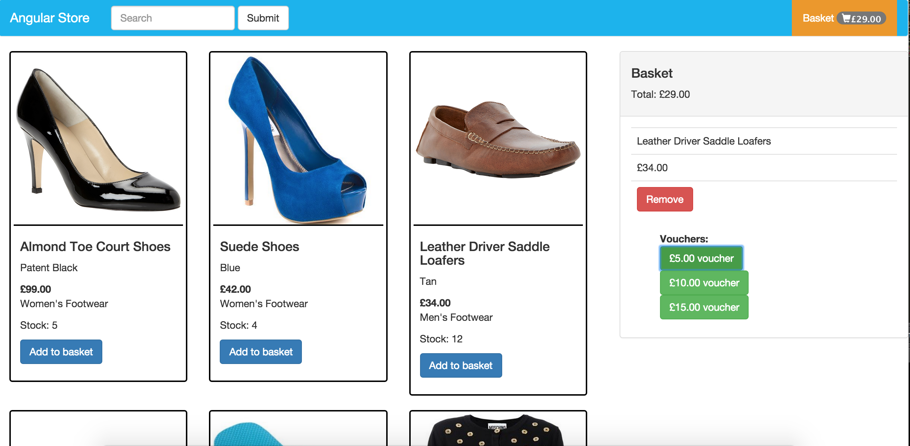

# Clothing Retailer
A responsive single page website created for a clothing retailer. The retailer sells six different categories of clothes: women’s footwear, men’s footwear, women’s casualwear, men’s casualwear, women’s formalwear and men’s formalwear.

<div align="center">
  
</div>

##Features
The following user stories have been implemented:

- [x] As a User I can browse a list of products and see their relevant information - such as availability and price.
- [x] As a User I can add a product to my shopping cart.
- [x] As a User I can remove a product from my shopping cart.
- [x] As a User I can view the total price for the products in my shopping cart.
- [x] As a User I can apply a voucher to my shopping cart.
- [x] As a User I can view the total price for the products in my shopping cart with discounts applied.
- [x] As a User I am alerted when I apply an invalid voucher to my shopping cart.
- [x] As a User I am unable to add out of stock products to my shopping cart.

There are also discount vouchers available that can be redeemed. The discount vouchers are as follows:
• £5.00 off your order
• £10.00 off when you spend over £50.00
• £15.00 off when you have bought at least one footwear item and spent over £75.00

##To Run
```
$ git clone https://github.com/katebeavis/clothing-retailer.git
$ cd clothing-retailer
$ npm install
$ bower install
$ npm start
visit http://localhost:3000
```

##To Run Tests
```
$ webdriver-manager start
$ grunt (To run all tests)
$ karma start test/karma.conf.js (To run just unit tests)
$ protractor test/e2e/conf.js (To run just Protractor tests)
```
You must have the server running to run grunt/protractor tests

##Technologies Used
- Angular JS
- Node JS
- Express
- HTML & CSS
- Bootstrap
- Karma
- Protractor

##Future Improvements
- Refactor code and take logic out of controllers by creating services for basket and products
- Refactor voucher discount into one method
- Refactor tests
- Change the basket so customers can type in the quantity of products they want to add
- Create 'voucher-code' verification
- Display the pre-discount total and the amount of discount that has been applied
